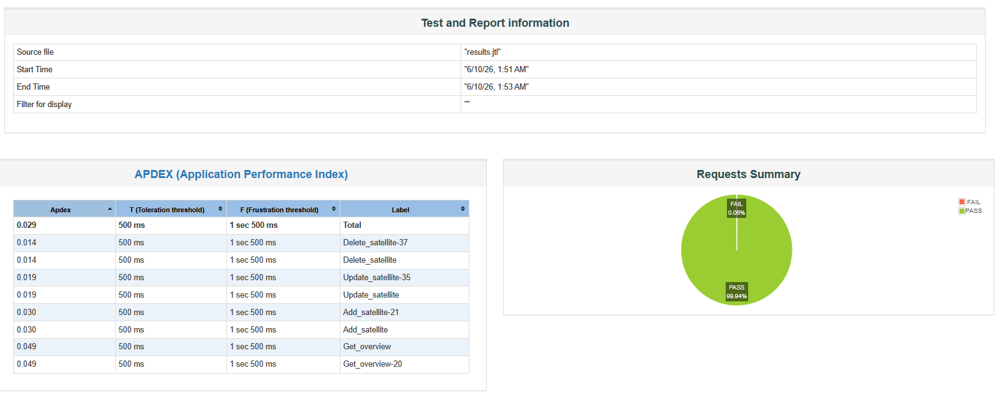
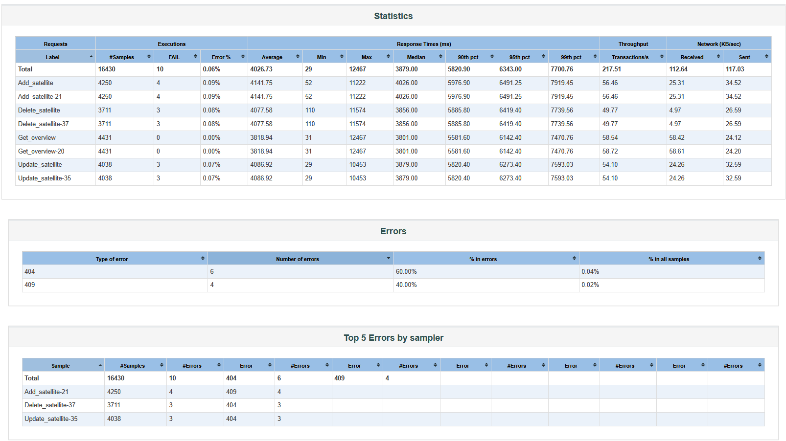

# Выполнение задания "Разработка нагрузочных тестов"

При разработке тестов использовалась программа Apache JMeter 5.6.3.

## Реализация

В тестах применялось:
- количество пользователей:     1000;
- время разгона пользователей:  10 сек;
- длительность тестов:          70 сек.

### Пользовательский сценарий нагрузочного теста
1. запрашивается get_overview, GET-запрос (сводная информация по системе, содержащая все группировки и спутники);
2. создается спутник, POST-запрос (в имени спутника используется шаблон с Random-числом), после получения ответа используется JSON Extractor откуда сохраняется имя и id спутника;
3. изменяется имя спутника, PUT-запрос (используется id и имя спутника полученные в шаге 2, к имени добавляется new и Random-число);
4. удаляется спутник по id, DELETE-запрос (используется id полученный в шаге 2).

## Результаты
Файл теста [Test_Satellite_service.jmx](jmeter-tests/tests/Test_Satellite_service.jmx)

Сформирован [HTML-отчет](jmeter-tests/report/index.html)

Отчеты добавил в репозиторий для удобства.

#### Дашборд:
Скриншот дашборда 

Скриншот дашборда - статистика тестов 

#### Разные графы
Aggregate Graph 

Graph Results 

Response Time Graph

## Запуск тестов
Я запускал под Windows 10.

Прогон тестов:
```
jmeter -n -t jmeter-tests\tests\Test_Satellite_service.jmx -l jmeter-tests\results.jtl -j jmeter-tests\jmeter.log
```

Подготовка отчета:
```
jmeter -g jmeter-tests\results.jtl -o jmeter-tests\report
```
В Linux прогон тестов и подготовка отчета:
```
jmeter -n -t jmeter-tests/tests/Test_Satellite_service.jmx \
       -l jmeter-tests/results.jtl \
       -j jmeter-tests/jmeter.log

jmeter -g jmeter-tests/results.jtl -o jmeter-tests/report
```

Отчет будет находится в файле [index.html](jmeter-tests/report/index.html)
Статистика в файле [statistics.json](jmeter-tests/report/statistics.json)


[README.MD тестируемого проекта](README.MD)